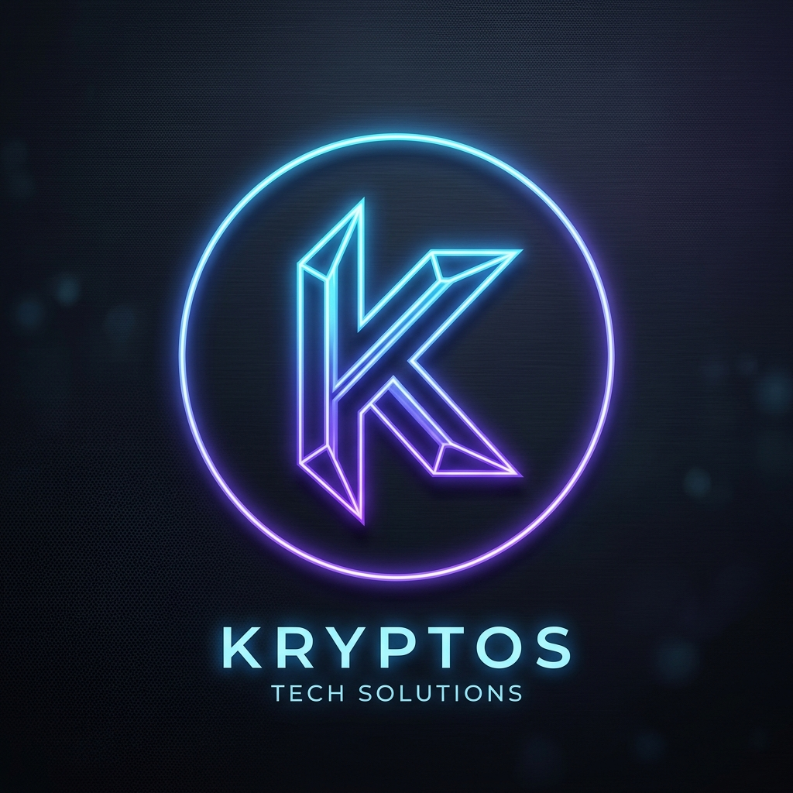

<div align="center">
  <br />
  <picture>
    <source media="(prefers-color-scheme: dark)" srcset="public/images/favicon-krevus.png">
    <source media="(prefers-color-scheme: light)" srcset="public/images/favicon-krevus.png">
    
  </picture>
  <br />
  <br />

  # ⚡ Krevus Agency Platform

  **Digital Infrastructure Built for Scale**
  
  <p align="center">
    <a href="https://nextjs.org/"></a>
    <a href="https://reactjs.org/"></a>
    <a href="https://tailwindcss.com/"></a>
    <a href="https://greensock.com/gsap/"></a>
    <a href="https://www.typescriptlang.org/"></a>
  </p>

  <p align="center">
    A premium, high-performance agency portfolio and enterprise portal. Built for tax firms, fintech startups, and real estate companies who require robust, compliant digital systems.
  </p>

  <br />
</div>

<hr />

## 🌟 Overview

The Krevus Platform is a state-of-the-art agency website designed to communicate extreme competence, speed, and technical excellence. It moves away from generic brochure sites to offer a **premium, app-like experience** powered by advanced scroll-triggered animations, dynamic layouts, and a sophisticated design system.

### 🎯 Key Highlights
- **Premium Aesthetics:** Dark-mode by default with tailored HSL accents, glassmorphism, and radial gradients.
- **Fluid Animations:** Powered by GSAP `ScrollTrigger` — featuring mask-reveals, staggered cards, infinite marquees, and a custom magnetic cursor.
- **SMB Portal (Briqly):** A dedicated, distinct sub-brand (`/briqly`) offering transparent, fixed-price websites for local businesses.
- **High Performance:** Server components by default, optimized fonts, and minimal client-side payloads.

---

## 🏗️ Architecture & Stack

| Technology | Purpose | Description |
| :--- | :--- | :--- |
| **[Next.js 15 (App Router)](https://nextjs.org/)** | Framework | Server-first React framework for maximum SEO and performance. |
| **[React 19](https://react.dev/)** | UI Library | Component-driven architecture using modern hooks and patterns. |
| **[TypeScript](https://www.typescriptlang.org/)** | Language | Strict static typing for bug-free, scalable code. |
| **[Tailwind CSS 3.4](https://tailwindcss.com/)** | Styling | Utility-first CSS mapped to a custom design token system. |
| **[GSAP & ScrollTrigger](https://gsap.com/)** | Animation | Professional-grade, butter-smooth scroll animations and transitions. |
| **[Lucide React](https://lucide.dev/)** | Iconography | Clean, consistent SVG icons mapped to brand colors. |

---

## 🎨 Design System

Our design language relies on strict CSS variables defined in `globals.css` to ensure visual consistency across the entire platform.

<details>
<summary><b>Click to view Core Color Palette</b></summary>

- **Background (Primary):** `hsl(222.2 84% 4.9%)` *(Deep Midnight Blue)*
- **Background (Subtle):** `hsl(222.2 47% 11%)` *(Elevated Card Backing)*
- **Text (Primary):** `hsl(210 40% 98%)` *(Crisp White)*
- **Text (Muted):** `hsl(215 20.2% 65.1%)` *(Accessible Gray)*
- **Primary Accent:** `hsl(217.2 91.2% 59.8%)` *(Vibrant Blue)*
- **Briqly SMB Accent:** `hsl(43 100% 47%)` *(Warm Amber)*
</details>

<details>
<summary><b>Click to view Typography System</b></summary>

- **Headings:** Outfit (Variable) — Tracking-tight, bold, authoritative.
- **Body:** Inter (Variable) — Highly legible, neutral, precise.
</details>

---

## 🚀 Getting Started

### 1. Clone the repository
```bash
git clone https://github.com/ab9898998989898/Krevus.git
cd Krevus
```

### 2. Install dependencies
```bash
npm install
# or
yarn install
# or
pnpm install
```

### 3. Run the development server
```bash
npm run dev
```
Navigate to [http://localhost:3000](http://localhost:3000) to view the Krevus main site.
Navigate to [http://localhost:3000/briqly](http://localhost:3000/briqly) to view the Briqly SMB portal.

---

## 📁 Project Structure

```text
c:\krevus\
├── 📂 app/                     # Next.js App Router root
│   ├── 📂 about/               # About page & client sections
│   ├── 📂 briqly/              # Briqly SMB sub-brand portal
│   ├── 📂 case-studies/        # Case studies index & dynamic slugs
│   ├── 📂 industries/          # Industry overviews (Fintech, Tax, etc.)
│   ├── 📂 services/            # Services overview & deliverables
│   ├── layout.tsx              # Root layout & global providers
│   └── page.tsx                # Krevus Homepage
├── 📂 components/
│   ├── 📂 forms/               # Contact & Lead generation forms
│   ├── 📂 layout/              # Header, Footer, CustomCursor
│   ├── 📂 sections/            # Reusable page blocks (Hero, Stats, etc.)
│   └── 📂 ui/                  # Atomic components (Buttons, Cards, Inputs)
├── 📂 hooks/                   # Custom GSAP & React hooks
├── 📂 lib/                     # Utilities (GSAP registry, MDX parser, etc.)
└── globals.css                 # Global styles & design tokens
```

---

## 💡 Key Features & Pages

### 🏢 Krevus Main Site (`/`)
- **Homepage:** Dynamic hero, tech marquee, animated stats, and staggered testimonials.
- **Services:** Breakdown of Portals, AI Automation, and Dashboards with "Capabilities" grid.
- **Industries:** Problem/Solution matrices for Tax, Fintech, and Real Estate.
- **Case Studies:** Rich, data-driven success stories with before/after metrics.
- **About:** Animated company timeline, philosophy, and core values.

### 🏪 Briqly SMB Portal (`/briqly`)
- **Distinct Branding:** Uses the warm `var(--amber)` accent to differentiate from the enterprise Krevus brand.
- **Pricing Cards:** Transparent, fixed-tier pricing.
- **"The Upgrade" Showcase:** Side-by-side Before/After business transformations.
- **FAQ & Testimonials:** Interactive accordions and star-rated client reviews.

---

## 🛠️ Animation Philosophy

We use **GSAP** exclusively for complex orchestrations. We intentionally avoid CSS transitions for layout changes to maintain consistent frame rates.

- **`useGsapSectionReveal`**: Standard fade-up-and-in for major page blocks.
- **`useGsapStaggerCards`**: Staggered entry for grid items (Stats, Services, Case Studies).
- **Word Mask Reveal**: Custom clip-path animations for premium typography entrances (replaces standard letter scrambling).
- **Custom Cursor**: A magnetic, trailing cursor that adapts to interactive elements (`<CustomCursor />`).

---

<div align="center">
  <br />
  <p>
    Built with precision by the Krevus Engineering Team. <br />
    <i>"Most agencies build brochures. We build engines."</i>
  </p>
  <a href="https://krevus.org" target="_blank">
    
  </a>
</div>
